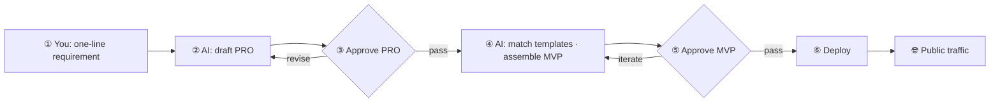

<div align="center">

# Maker Flow

### A personal MVP incubation pipeline

**Heavy infrastructure, light logic.** Kill repeated setup so the path from idea → public validation has minimal friction.

You provide **requirements** and **two approvals**. AI agents execute against a skill library and template set.

<br/>

**English** · [简体中文](README.zh-CN.md)

<br/>

[](LICENSE)
[](#six-step-pipeline)
[](templates/apps/go-api/)
[](AGENTS.md)

<br/>

[Getting started](docs/getting-started.md) · [Live example](docs/examples/static-intro-github-pages.md) · [Template catalog](templates/CATALOG.md) · [Skills catalog](skills/CATALOG.md) · [For agents](AGENTS.md) · [Docs index](docs/README.md)

</div>

---

## Why it exists

For indie builders, friction is often not business code — it is **rebuilding the environment every time**:

| Without Maker Flow | With Maker Flow |
|--------------------|-----------------|
| Pick a stack, write Docker, wire Nginx for every idea | Templates ready to run |
| AI codes first; wrong direction wastes the day | **Two gates**: PRO → MVP |
| Prompts and deploy steps live in your head | Skills encode SOPs; agents follow them |
| Many ideas, repeated plumbing | Focus on validation; public URL in ~10 minutes |

> This is **not one product**. It is a forkable, reusable **MVP factory**.  
> **Recommended:** keep this repo as the public tool; build each MVP in a **separate private product repo** → [consumer guide](docs/consumer-project.md).

---

## Six-step pipeline



| Step | You | AI agent |
|:----:|-----|----------|
| 1 | Provide requirement | — |
| 2 | — | Draft PRO (**no code**) |
| 3 | **Approve PRO** | Wait |
| 4 | — | Match templates → assemble in **product repo** |
| 5 | **Local acceptance** | Fix against PRO |
| 6 | Confirm where to publish | Ask in chat → follow `release/publish/` |

Two gates are the core design: **align on what first, then how**.

---

## What’s in the repo

```
        ┌─────────────┐
        │  You + AI   │
        └──────┬──────┘
               │
    ┌──────────┼──────────┐
    ▼          ▼          ▼
 skills/   templates/   release/
  (HOW)      (WHAT)      (SHIP)
```

| Module | Path | One line |
|--------|------|----------|
| Skills | [`skills/`](skills/) · [**catalog**](skills/CATALOG.md) | How agents draft PRO, match templates, publish |
| Templates | [`templates/`](templates/) · [**catalog**](templates/CATALOG.md) | apps + images + patterns |
| Release | [`release/`](release/) · [`publish/`](release/publish/) | Multi-target publish guides + VPS gateway |
| Optional LLM | [`docs/optional-llm.md`](docs/optional-llm.md) | Rare: self-hosted OpenAI-compatible APIs |

---

## 60-second start

```bash
curl -fsSL https://raw.githubusercontent.com/LJTian/maker-flow/main/scripts/install.sh | bash
maker-flow new my-first-mvp
cd ~/projects/my-first-mvp
```

Open the **product repo** in Cursor, `@AGENTS.md`, start at step ①.

<details>
<summary>Contributors: install from a git clone</summary>

```bash
git clone https://github.com/LJTian/maker-flow.git && cd maker-flow
./scripts/install.sh
maker-flow new my-first-mvp
```

</details>

**A — Cursor Agent (recommended)**

1. Open the **product repo** (`~/projects/<name>/`) in Cursor
2. Start a chat:

   > Follow @AGENTS.md. I want to build [your idea], starting at step ①.

3. Approve PRO and MVP at steps ③ and ⑤

**B — Smoke a template (no AI)**

```bash
mkdir -p /tmp/maker-flow-smoke
cp -r templates/apps/go-api /tmp/maker-flow-smoke/smoke-test
cd /tmp/maker-flow-smoke/smoke-test && cp .env.example .env
docker compose up --build
curl http://localhost:8080/health
```

Or scaffold a product repo: `maker-flow new smoke-test` and copy template files there.

Full guide → **[docs/getting-started.md](docs/getting-started.md)** · [中文](docs/getting-started.zh-CN.md)

**Live example:** static intro with `web-vite` → GitHub Pages — [walkthrough](docs/examples/static-intro-github-pages.md) · [demo](https://LJTian.github.io/maker-flow-vite/)

---

## Who it’s for

- People with **many ideas** who want fast public feedback
- Anyone using **Cursor / Claude** agents who is tired of prompting from scratch
- Builders who want a **forkable private pipeline**, not another todo demo
- Anyone who buys **heavy infra, light logic**: write plumbing once, run N ideas

---

## After you Star / Fork

| Action | Suggestion |
|--------|------------|
| Star | Track skill / template updates |
| Fork / clone | Use as the shared factory (public) |
| Each new idea | **New private product repo** + [consumer guide](docs/consumer-project.md) (`maker-flow new <name>`) |
| Pin agent behavior | Factory: [AGENTS.md](AGENTS.md) · Product repo: [AGENTS.consumer.example.md](AGENTS.consumer.example.md) |

---

## Suggested machine roles

| Machine | Role |
|---------|------|
| GPU box (optional) | Inference only; main machine calls via `AI_BASE_URL` |
| Apple Silicon Mac | Dev, acceptance, product repos |
| Cloud VPS | Docker Nginx gateway on port 80; MVPs on shared network `maker-flow` |

---

## Docs map

| Humans | AI agents |
|--------|-----------|
| [Getting started](docs/getting-started.md) | [AGENTS.md](AGENTS.md) |
| [Consumer project](docs/consumer-project.md) · [Overview](docs/overview.md) | [workflow.md](docs/workflow.md) |
| [Template catalog](templates/CATALOG.md) · [Skills catalog](skills/CATALOG.md) | [agent-bootstrap.md](docs/agent-bootstrap.md) |
| [Docs index](docs/README.md) · [i18n](docs/i18n.md) | [AGENTS.consumer.example.md](AGENTS.consumer.example.md) (product repos) |

---

## Acknowledgments

Maker Flow stands on these projects — thanks to maintainers and communities:

| Use | Project | URL |
|-----|---------|-----|
| Go web (`go-api`) | **Gin** | https://github.com/gin-gonic/gin |
| Web UI (`web-vite`) | **Vite** · **React** · **Tailwind CSS** | https://vite.dev/ · https://react.dev/ · https://tailwindcss.com/ |
| CLI (`go-cli`) | **Cobra** | https://github.com/spf13/cobra |
| singleflight (pattern) | **golang.org/x/sync** | https://pkg.go.dev/golang.org/x/sync/singleflight |
| Build fragment (Go) | **golang** (official) | https://hub.docker.com/_/golang |
| Runtime fragment (Alpine) | **Alpine Linux** | https://alpinelinux.org/ · https://hub.docker.com/_/alpine |
| Containers | **Docker** | https://www.docker.com/ |
| Reverse proxy | **Nginx** | https://nginx.org/ |
| DNS / edge SSL | **Cloudflare** | https://www.cloudflare.com/ |
| Optional local LLM | **Ollama** | https://ollama.com/ · https://github.com/ollama/ollama |
| Agent protocol reference | **Model Context Protocol** | https://modelcontextprotocol.io/ |

Missing a credit? Open an Issue / PR.

---

<div align="center">

**If this pipeline helps you, a Star is the best nod to “heavy infrastructure.”**

<br/>

[Get started](docs/getting-started.md) · [Fork your factory](https://github.com/LJTian/maker-flow/fork)

</div>

## License

MIT — use freely and adapt as needed.
