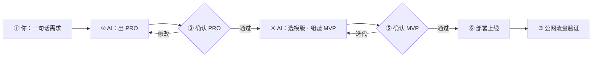

<div align="center">

# Maker Flow

### 个人专属 MVP 极速孵化流水线

**重基建，轻逻辑。** 把重复的配置消灭掉，让「想法 → 公网验证」的摩擦力降到最低。

你负责 **提需求** 和 **两次确认**，AI 智能体按预制技能库与模版集执行。

<br/>

[English](README.md) · **简体中文**

<br/>

[](LICENSE)
[](#六步流水线)
[](templates/apps/go-api/)
[](AGENTS.md)

<br/>

[快速开始](docs/getting-started.zh-CN.md) · [模版检索](templates/CATALOG.md) · [技能检索](skills/CATALOG.md) · [给 Agent 看](AGENTS.zh-CN.md) · [文档索引](docs/README.zh-CN.md)

</div>

---

## 为什么需要它

独立开发者最大的摩擦，往往不在写业务代码，而在**每次从零配环境**：

| 没有 Maker Flow | 有 Maker Flow |
|-----------------|---------------|
| 每个点子重新选框架、写 Docker、配 Nginx | 模版集开箱即用 |
| AI 一口气生成，方向错了才发现 | **两次确认**：PRO → MVP |
| Prompt 和部署流程靠脑子记 | 技能库写死 SOP，Agent 照章办事 |
| 想法多，基建重复劳动 | 专注验证，10 分钟级公网上线 |

> **这不是某个具体产品**，而是一套可 Fork、可 Star、可反复复用的 **MVP 工厂**。  
> **推荐：** 本仓作公开工具仓；每个 MVP 用 **独立私有产品仓** → [消费侧指南](docs/consumer-project.zh-CN.md)。

---

## 六步流水线



| 步 | 你 | AI 智能体 |
|:--:|-----|-----------|
| 1 | 提供需求 | — |
| 2 | — | 输出 PRO（方案，**不写代码**） |
| 3 | **确认 PRO** | 等待 |
| 4 | — | 检索模版 → 组装到**产品仓** |
| 5 | **本地验收** | 按 PRO 修改 |
| 6 | 触发部署 | 执行 `release/` 脚本 |

两次确认是核心设计：**先对齐「做什么」，再动手「怎么做」。**

---

## 仓库里有什么

```
        ┌─────────────┐
        │   你 + AI   │
        └──────┬──────┘
               │
    ┌──────────┼──────────┐
    ▼          ▼          ▼
 skills/   templates/   release/
 技能库      模版集       发布基建
  (HOW)      (WHAT)      (SHIP)
```

| 模块 | 目录 | 一句话 |
|------|------|--------|
| 技能库 | [`skills/`](skills/) · [**检索目录**](skills/CATALOG.md) | 约束 Agent：PRO 怎么写、模版怎么选、怎么部署 |
| 模版集 | [`templates/`](templates/) · [**检索目录**](templates/CATALOG.md) | apps + images + patterns |
| 发布基建 | [`release/`](release/) | Nginx + Cloudflare + 一键部署脚本 |
| 可选 LLM | [`docs/optional-llm.zh-CN.md`](docs/optional-llm.zh-CN.md) | 少见：自建 OpenAI 兼容 API |

---

## 60 秒上手

```bash
curl -fsSL https://raw.githubusercontent.com/LJTian/maker-flow/main/scripts/install.sh | bash
maker-flow new my-first-mvp
cd ~/projects/my-first-mvp
```

用 Cursor 打开**产品仓**，`@AGENTS.md`，从步骤 ① 开始。

<details>
<summary>贡献者：从 git 克隆安装</summary>

```bash
git clone https://github.com/LJTian/maker-flow.git && cd maker-flow
./scripts/install.sh
maker-flow new my-first-mvp
```

</details>

**方式 A — Cursor Agent（推荐）**

1. 用 Cursor 打开**产品仓**（`~/projects/<名字>/`）
2. 新建对话，输入：

   > 按 @AGENTS.md，我要做一个 [你的想法]，从步骤 ① 开始。

3. 在步骤 ③、⑤ 确认 PRO 和 MVP

**方式 B — 先验模版（无需 AI）**

```bash
mkdir -p /tmp/maker-flow-smoke
cp -r templates/apps/go-api /tmp/maker-flow-smoke/smoke-test
cd /tmp/maker-flow-smoke/smoke-test && cp .env.example .env
docker compose up --build
curl http://localhost:8080/health
```

或脚手架产品仓：`maker-flow new smoke-test`，再把模版文件拷进去。

完整教程 → **[docs/getting-started.zh-CN.md](docs/getting-started.zh-CN.md)**

---

## 适合谁

- 经常有**天马行空的想法**，想快速丢到公网看反馈
- 已经用 **Cursor / Claude** 等 Agent，但厌倦了每次从零 prompt
- 想要一套**可 Fork 的私人流水线**，而不是又一个 Todo Demo
- 认同 **重基建、轻逻辑**：基建写一次，点子跑 N 次

---

## Star / Fork 之后

| 动作 | 建议 |
|------|------|
| Star | 跟踪技能库 / 模版更新 |
| Fork / clone | 作为共享工厂（公开） |
| 每个新点子 | **新建私有产品仓** + [消费侧指南](docs/consumer-project.zh-CN.md)（`maker-flow new <名字>`） |
| 固定 Agent 行为 | 工厂：[AGENTS.zh-CN.md](AGENTS.zh-CN.md) · 产品仓：[AGENTS.consumer.example.zh-CN.md](AGENTS.consumer.example.zh-CN.md) |

---

## 推荐设备分工

| 设备 | 角色 |
|------|------|
| GPU 机（可选） | 纯推理节点，主力机通过 `AI_BASE_URL` 远程调用 |
| M 系 Mac | 开发、验收、产品仓 |
| 云服务器 | Docker Nginx 网关占 80；MVP 走共享网络 `maker-flow` |

---

## 文档导航

| 给人看 | 给 AI 智能体看 |
|--------|----------------|
| [快速开始](docs/getting-started.zh-CN.md) | [AGENTS.md](AGENTS.zh-CN.md) |
| [消费侧项目](docs/consumer-project.zh-CN.md) · [架构图解](docs/overview.zh-CN.md) | [workflow.zh-CN.md](docs/workflow.zh-CN.md) |
| [模版检索](templates/CATALOG.md) · [技能检索](skills/CATALOG.md) | [agent-bootstrap.md](docs/agent-bootstrap.md) |
| [文档索引](docs/README.zh-CN.md) · [国际化](docs/i18n.zh-CN.md) | [AGENTS.consumer.example.zh-CN.md](AGENTS.consumer.example.zh-CN.md)（产品仓） |

---

## 致谢 · 开源依赖

Maker Flow 站在这些优秀项目之上，感谢维护者与社区：

| 用途 | 项目 | 地址 |
|------|------|------|
| Go Web 框架（`go-api`） | **Gin** | https://github.com/gin-gonic/gin |
| Web UI（`web-vite`） | **Vite** · **React** · **Tailwind CSS** | https://vite.dev/ · https://react.dev/ · https://tailwindcss.com/ |
| CLI 框架（`go-cli`） | **Cobra** | https://github.com/spf13/cobra |
| singleflight（pattern） | **golang.org/x/sync** | https://pkg.go.dev/golang.org/x/sync/singleflight |
| 编译片段 (Go) | **golang** (official image) | https://hub.docker.com/_/golang |
| 运行片段 (Alpine) | **Alpine Linux** | https://alpinelinux.org/ · https://hub.docker.com/_/alpine |
| 容器运行时 | **Docker** | https://www.docker.com/ |
| 反向代理 | **Nginx** | https://nginx.org/ |
| DNS / 边缘 SSL（发布层） | **Cloudflare** | https://www.cloudflare.com/ |
| 可选本地推理 | **Ollama** | https://ollama.com/ · https://github.com/ollama/ollama |
| Agent 协议参考 | **Model Context Protocol** | https://modelcontextprotocol.io/ |

若遗漏了你的项目，欢迎提 Issue / PR，我们会补上致谢。

---

<div align="center">

**如果这套流水线对你有用，欢迎 Star — 这是对「重基建」最好的认可。**

<br/>

[开始使用](docs/getting-started.zh-CN.md) · [Fork 成自己的工厂](https://github.com/LJTian/maker-flow/fork)

</div>

## License

MIT · 个人使用，按需调整。
