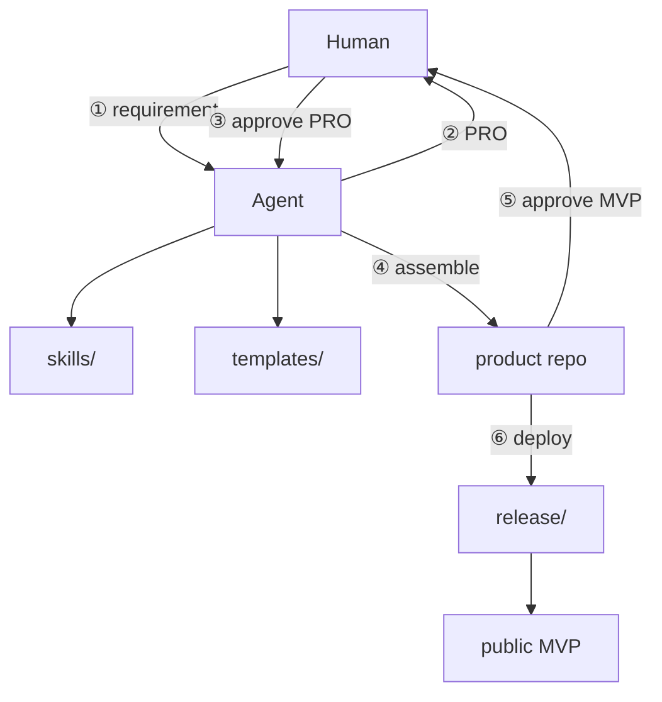

# Architecture (agent map)

**English** · [简体中文](architecture.zh-CN.md)

## Principles

- Templates + skills are the product; agent fills business logic only.
- Two human gates: PRO before code; MVP before deploy.
- Agent writes artifacts to defined paths; do not scatter files.
- English primary docs are authoritative; see `docs/i18n.md`.
- **Recommended layout:** factory (`~/.maker-flow` or this repo) is read-only skills/templates; each MVP lives in a **separate product repo** (created with `maker-flow new <name>`).

## Component map

## Directories

| Path | Agent use |
|------|-----------|
| `skills/` | Authoritative HOW for each step |
| `templates/` | Searchable scaffolds; catalog = `index.md` |
| `prompts/` | Stage input templates |
| **product repo** | **Only** write target for step 4–6 (see `docs/consumer-project.md`; create with `maker-flow new <name>`) |
| `release/` | Step-6 publish primitives (`publish/` targets + VPS gateway); agent follows dialogue in `skills/deploy.md` |
| `scripts/` | `install.sh`, `maker-flow` CLI, `check.sh` |
| `docs/` | Workflow / architecture contracts |

## Step → path map

| Step | Actor | Paths |
|------|-------|-------|
| 1 | Human | requirement text |
| 2 | Agent | `skills/pro-generation.md`, `prompts/02-pro-draft.md` |
| 3 | Human | confirmed PRO (`pro.md` in product repo, or factory example) |
| 4 | Agent | `template-matching` + `mvp-assembly` + `templates/` → **product repo root** |
| 5 | Human | assembled project + PRO acceptance |
| 6 | Agent | `skills/deploy.md`, `prompts/06-publish.md`, `release/publish/` |

## Related

- `docs/workflow.md`
- `docs/consumer-project.md`
- `docs/agent-bootstrap.md`
- `docs/getting-started.md` (human)
- `docs/i18n.md`
- `AGENTS.md` · `AGENTS.consumer.example.md`
