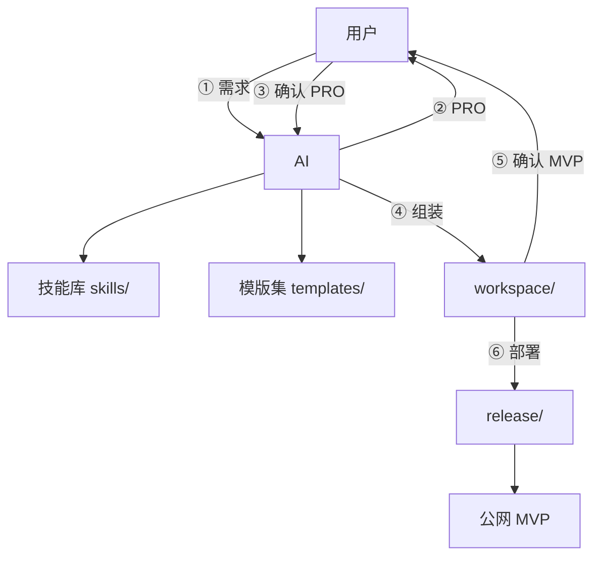

# 架构说明

## 设计原则

- **重基建，轻逻辑**：模版集 + 技能库预制，AI 只出 PRO 与组装。
- **两次确认**：PRO 定稿前不写代码；MVP 验收前不部署。
- **设备解耦**：GPU 推理（可选）、Mac 开发、服务器网关。

## 系统全景

## 模块职责

| 模块 | 目录 | 职责 |
|------|------|------|
| AI 连接 | `ai-engine/` | `.env`、providers、参数 |
| 技能库 | `skills/` | PRO 生成、模版检索、组装、部署 SOP |
| 模版集 | `templates/` | 可检索预制工程 + `index.md` |
| Prompt | `prompts/` | 分阶段输入（需求 / PRO / 组装） |
| 工作区 | `workspace/` | 步骤 ④ 产出的 MVP 项目 |
| 发布 | `release/` | Nginx、Cloudflare、部署脚本 |

## 六步与仓库映射

| 步 | 用户/AI | 仓库触点 |
|----|---------|----------|
| 1 | 用户给需求 | `prompts/01-requirement.example.md` |
| 2 | AI 出 PRO | `prompts/02-pro-draft.md` + `skills/pro-generation.md` |
| 3 | 确认 PRO | `prompts/03-pro-confirmed.example.md` |
| 4 | AI 检索+组装 | `prompts/04-assemble-mvp.md` + `skills/template-matching.md` + `skills/mvp-assembly.md` + `templates/index.md` |
| 5 | 确认 MVP | `workspace/<项目名>/` + `docker compose` |
| 6 | 部署 | `skills/deploy.md` + `release/` |

## 相关文档

- [六步工作流](workflow.md)
- [快速开始](getting-started.md)
- [技能库](../skills/README.md)
- [模版目录](../templates/index.md)
