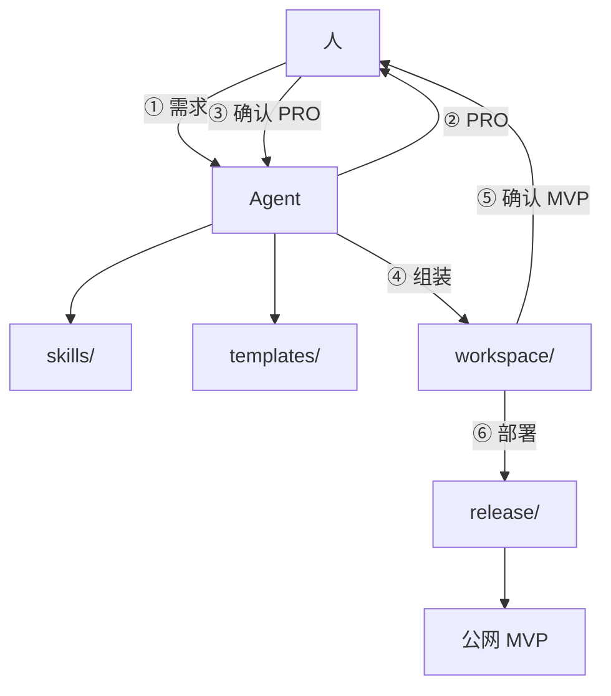

# 架构（Agent 映射）

[English](architecture.md) · **简体中文**

## 原则

- 模版 + 技能才是产品；Agent 只填业务逻辑。
- 两道人门禁：写代码前确认 PRO；部署前确认 MVP。
- Agent 按约定路径写产物，不要散落文件。
- 英文主版文档为权威；见 `docs/i18n.md`。

## 组件关系

## 目录

| 路径 | Agent 用途 |
|------|------------|
| `skills/` | 各步骤权威 HOW |
| `templates/` | 可检索脚手架；目录 = `index.md` |
| `prompts/` | 分阶段输入模版 |
| `workspace/` | 组装 MVP 代码的唯一写出位置 |
| `release/` | 步骤 ⑥ 部署原语 |
| `ai-engine/` | 可选远程 LLM 连接说明（宿主 Agent 场景通常不用） |
| `docs/` | 流程 / 架构契约 |

## 步骤 → 路径

| 步 | 角色 | 路径 |
|----|------|------|
| 1 | 人 | 需求文本 |
| 2 | Agent | `skills/pro-generation.md`、`prompts/02-pro-draft.md` |
| 3 | 人 | 定稿 PRO 文件 |
| 4 | Agent | `skills/template-matching.md`、`skills/mvp-assembly.md`、`templates/index.md`、`workspace/<name>/` |
| 5 | 人 | `workspace/<name>/` + PRO 验收 |
| 6 | Agent | `skills/deploy.md`、`release/` |

## 相关

- `docs/workflow.md`
- `docs/agent-bootstrap.md`
- `docs/getting-started.md`（人）
- `docs/i18n.md`
- `AGENTS.md`
