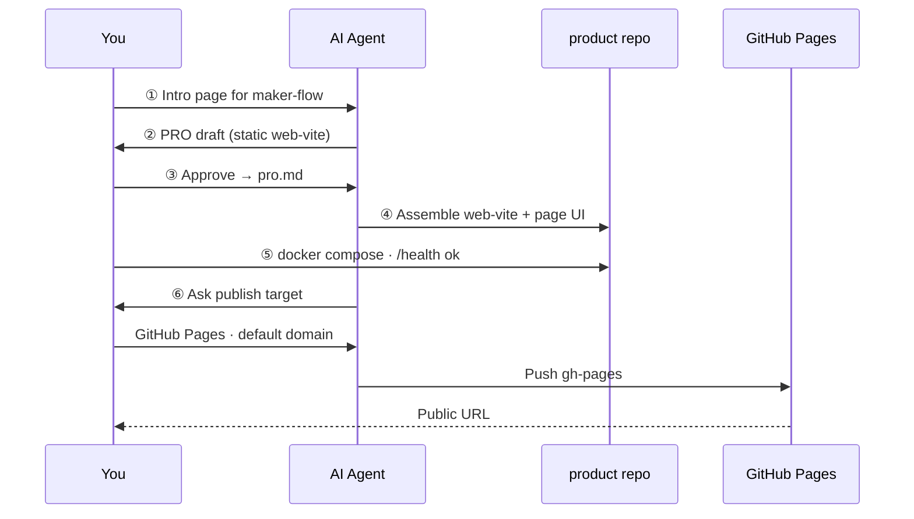

# Example: static intro site → GitHub Pages

**English** · [简体中文](static-intro-github-pages.zh-CN.md)

A real, short run of the six-step pipeline: ship a **static intro page** for Maker Flow itself with `web-vite`, then publish to **GitHub Pages**.

| | |
|--|--|
| **Live demo** | https://LJTian.github.io/maker-flow-vite/ |
| **Product repo** | https://github.com/LJTian/maker-flow-vite |
| **Time box** | Roughly one focused session |
| **Template** | `web-vite` |
| **Publish** | `github-pages` |

Use this when you want a **browser UI / landing page** MVP with no API and a public URL on the platform default domain.

---

## What we built

- Single-page intro for [LJTian/maker-flow](https://github.com/LJTian/maker-flow)
- English-primary copy + in-page **EN / 中文** switch
- Local acceptance via Docker (`GET /health`)
- Public site on GitHub Pages project URL

**Out of scope for this example:** backend API, custom domain, Cloudflare/Vercel (same static site can use those targets later).

---

## Pipeline map



---

## Step by step (what happened)

### ① Requirement

> Add a static web intro page for https://github.com/LJTian/maker-flow

Product repo created with `maker-flow new` (here: `maker-flow-vite`). Open **that** repo in the agent — not the factory install.

### ②–③ PRO

Agent drafted a PRO: static only, English primary, `GET /` + `GET /health`, no DB/auth. Human confirmed (including later EN/中文 toggle). Confirmed PRO lives in the product repo as `pro.md`.

### ④ Assemble

- Matched **`web-vite`** (no patterns)
- Copied template into the **product repo root**
- Replaced the placeholder UI with the intro page
- Kept container-first layout (`Dockerfile`, `docker-compose.yml`, Nginx `/health`)

### ⑤ Accept

```bash
cd ~/projects/maker-flow-vite   # your product repo
cp -n .env.example .env
docker compose up --build
curl -sf http://localhost:3000/health
# {"status":"ok"}
```

Open http://localhost:3000/ and check brand, CTA → GitHub, six-step section, language switch.

### ⑥ Publish (GitHub Pages)

In chat the agent asked **what / where / domain / credentials**. Answers for this run:

1. Whole frontend  
2. GitHub Pages  
3. Platform default URL  
4. Human provided a GitHub token when asked (do **not** commit tokens)

Agent then:

1. Set Vite `base` to `/maker-flow-vite/` (project Pages path)
2. Pushed source to `main` on `LJTian/maker-flow-vite`
3. Built `dist/` and force-pushed branch `gh-pages`
4. Enabled Pages from `gh-pages` `/`

Result: **https://LJTian.github.io/maker-flow-vite/**

You do **not** run a human-facing `maker-flow deploy` CLI — the agent follows `skills/deploy.md` and `release/publish/github-pages.md`.

---

## Try it yourself

```bash
maker-flow new my-intro --requirement "Static intro page for my open-source tool. English + Chinese toggle. Publish to GitHub Pages."
cd ~/projects/my-intro
```

In Cursor:

```
Read AGENTS.md and $MAKER_FLOW_ROOT/docs/workflow.md.
Start at step ① with my requirement in requirement.md.
```

After local acceptance, tell the agent step ⑤ passed and choose **GitHub Pages**.

---

## Tips

| Topic | Tip |
|-------|-----|
| Project Pages `base` | Vite `base` must be `/<repo>/` or assets 404 |
| Factory vs product | Never assemble into `~/.maker-flow`; product stays separate |
| Tokens | Paste in chat only if you must; revoke after publish |
| Other static targets | Same `dist/` can ship via Cloudflare Pages or Vercel — see `release/publish/` |

---

## Related

- [Getting started](../getting-started.md)
- [Consumer / product repos](../consumer-project.md)
- Publish guide: [`release/publish/github-pages.md`](../../release/publish/github-pages.md)
- Template: [`templates/apps/web-vite/`](../../templates/apps/web-vite/)
