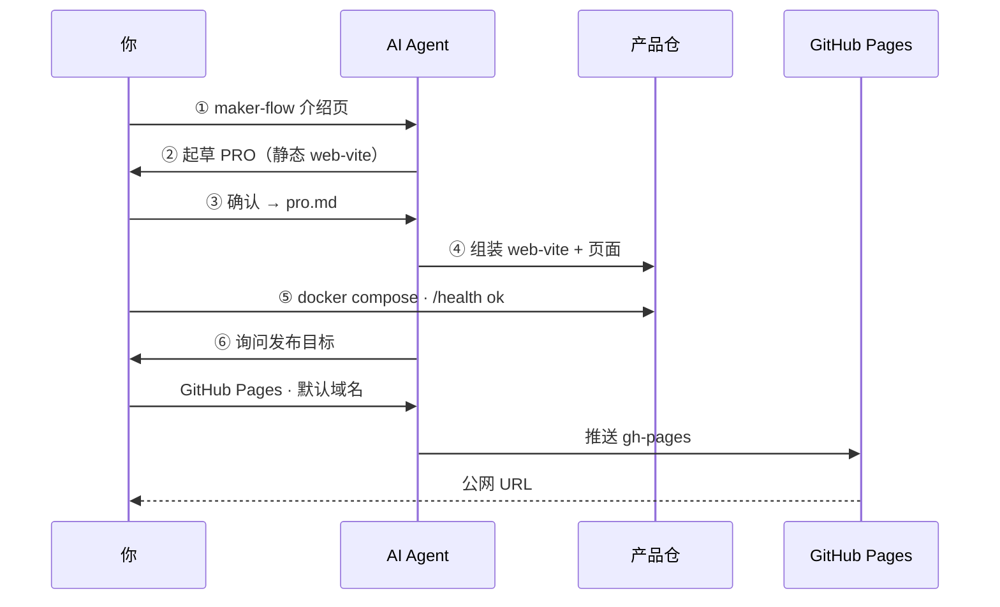

# 示例：静态介绍站 → GitHub Pages

[English](static-intro-github-pages.md) · **简体中文**

一次真实、简短的六步流水线：用 `web-vite` 为 Maker Flow 本身做**静态介绍页**，并发布到 **GitHub Pages**。

| | |
|--|--|
| **线上演示** | https://LJTian.github.io/maker-flow-vite/ |
| **产品仓** | https://github.com/LJTian/maker-flow-vite |
| **耗时** | 大约一次专注会话 |
| **模版** | `web-vite` |
| **发布** | `github-pages` |

适合想做**浏览器落地页 / 介绍站**、无 API、用平台默认域名公开访问的 MVP。

---

## 做了什么

- 为 [LJTian/maker-flow](https://github.com/LJTian/maker-flow) 做单页介绍
- 英文为主 + 页内 **EN / 中文** 切换
- Docker 本地验收（`GET /health`）
- GitHub Pages 项目站点公网 URL

**本示例不做：** 后端 API、自定义域名、Cloudflare/Vercel（同一静态站以后可换这些目标）。

---

## 流水线对照



---

## 逐步发生了什么

### ① 需求

> 给 https://github.com/LJTian/maker-flow 做一个静态 Web 介绍页

用 `maker-flow new` 创建产品仓（本例：`maker-flow-vite`）。在**产品仓**里开 Agent，不要在工厂安装目录里组装。

### ②–③ PRO

Agent 起草 PRO：纯静态、英文为主、`GET /` + `GET /health`、无 DB/鉴权。人确认（含后续中英切换）。定稿写在产品仓 `pro.md`。

### ④ 组装

- 匹配 **`web-vite`**（无 pattern）
- 拷贝到**产品仓根目录**
- 换成介绍页 UI
- 保留容器优先布局（`Dockerfile`、`docker-compose.yml`、Nginx `/health`）

### ⑤ 验收

```bash
cd ~/projects/maker-flow-vite   # 你的产品仓
cp -n .env.example .env
docker compose up --build
curl -sf http://localhost:3000/health
# {"status":"ok"}
```

打开 http://localhost:3000/，核对品牌、指向 GitHub 的 CTA、六步说明、语言切换。

### ⑥ 发布（GitHub Pages）

对话里 Agent 询问 **发什么 / 发哪里 / 域名 / 凭证**。本例回答：

1. 整站前端  
2. GitHub Pages  
3. 平台默认 URL  
4. 需要时由人提供 GitHub token（**禁止**把 token 提交进仓库）

Agent 随后：

1. 将 Vite `base` 设为 `/maker-flow-vite/`（项目站路径）
2. 推源码到 `LJTian/maker-flow-vite` 的 `main`
3. 构建 `dist/` 并推送到 `gh-pages`
4. 启用 Pages（`gh-pages` 分支 `/`）

结果：**https://LJTian.github.io/maker-flow-vite/**

人**不必**运行面向用户的 `maker-flow deploy` CLI——Agent 遵循 `skills/deploy.md` 与 `release/publish/github-pages.md`。

---

## 自己试一遍

```bash
maker-flow new my-intro --requirement "为我的开源工具做静态介绍页。中英切换。发布到 GitHub Pages。"
cd ~/projects/my-intro
```

在 Cursor：

```
Read AGENTS.md and $MAKER_FLOW_ROOT/docs/workflow.md.
Start at step ① with my requirement in requirement.md.
```

本地验收通过后，告诉 Agent 步骤 ⑤ 已通过，并选择 **GitHub Pages**。

---

## 提示

| 主题 | 提示 |
|------|------|
| 项目站 `base` | Vite `base` 须为 `/<repo>/`，否则资源 404 |
| 工厂 vs 产品 | 勿往 `~/.maker-flow` 组装；产品仓独立 |
| Token | 尽量少在对话里粘贴；发布后立刻撤销 |
| 其他静态目标 | 同一 `dist/` 也可走 Cloudflare Pages / Vercel — 见 `release/publish/` |

---

## 相关

- [快速开始](../getting-started.zh-CN.md)
- [消费侧 / 产品仓](../consumer-project.zh-CN.md)
- 发布指南：[`release/publish/github-pages.md`](../../release/publish/github-pages.md)
- 模版：[`templates/apps/web-vite/`](../../templates/apps/web-vite/)
