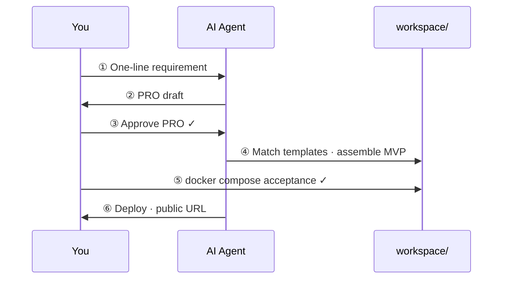

<div align="center">

# Getting started

### Six steps from idea to a public MVP with an AI agent

[← Home](../README.md) · [Agent contract](../AGENTS.md) · [简体中文](getting-started.zh-CN.md)

</div>

---

**English** · [简体中文](getting-started.zh-CN.md)

**Production MVPs:** separate private product repo — run `maker-flow new <name>` after [install](consumer-project.md). Factory lives at `~/.maker-flow`; products at `~/projects/<name>/`.

## Checklist

| Required | Optional |
|----------|----------|
| This repo (clone / fork) | Cloud VPS + domain |
| Cursor or another agent IDE | Cloudflare |
| Docker | Local GPU + Ollama |

---

## Flow at a glance



First-time rough timing:

| Phase | Time |
|-------|------|
| Setup + PRO | ~30 min |
| Assemble + local acceptance | ~1 hour |
| Deploy | ~10 min |

---

## Step by step

### Step 0 · Open the repo

Open `maker-flow` in **Cursor** (recommended).

Suggested first message:

```
Read AGENTS.md and docs/workflow.md first, then tell me you are ready.
```

---

### Step 1 · Provide a requirement

Edit [`prompts/01-requirement.example.md`](../prompts/01-requirement.example.md), or tell the agent:

> Build a mini todo API: create, complete, list. No user system.

---

### Step 2 · AI drafts PRO

Tell the agent:

```
Maker Flow step ②:
1. Read skills/pro-generation.md
2. Output a PRO from my requirement
3. Do not write any implementation code
```

PRO shape: [`prompts/pro.template.md`](../prompts/pro.template.md). Granularity: [`prompts/pro.example.md`](../prompts/pro.example.md).

---

### Step 3 · Approve PRO

Review the PRO:

- Can it ship in **1–2 days**?
- Is the **out of scope** list aggressive enough?
- Are APIs and data model implementable as written?

Persist to [`prompts/03-pro-confirmed.example.md`](../prompts/03-pro-confirmed.example.md) and mark **confirmed** (same sections as `pro.template.md`).

> **Gate:** Do not let the agent write code before approval.

---

### Step 4 · AI assembles MVP

```
PRO is confirmed (see prompts/03-pro-confirmed.example.md).
Step ④:
1. skills/template-matching.md + templates/index.md — choose apps/patterns
2. skills/mvp-assembly.md — assemble under workspace/
```

Expect a runnable project under `workspace/<project-name>/`.

---

### Step 5 · Local acceptance

```bash
cd workspace/<project-name>
cp .env.example .env
docker compose up --build
```

```bash
curl http://localhost:8080/health
# expect: {"status":"ok"}
```

Check every **acceptance criterion** in the PRO.  
Unhappy → iterate step 4 (code) or step 3 (scope).

---

### Step 6 · Deploy

After MVP approval:

```
MVP accepted. Deploy per skills/deploy.md and release/.
```

Or manually:

```bash
export MVP_NAME=idea1
export DOMAIN=idea1.your-domain.com
export DEPLOY_HOST=deploy@your-server
export DEPLOY_PATH=/opt/mvps/idea1
export CONTAINER_PORT=8080   # web-vite: 80
export MVP_SERVICE=api       # or web / worker

./release/deploy/push-and-route.sh
```

Script syncs the Docker gateway, attaches the MVP to network `maker-flow`, and reloads Nginx.  
Then set Cloudflare DNS (Proxied) → `https://idea1.your-domain.com`

---

## FAQ

<details>
<summary><b>Agent skips steps?</b></summary>

Explicitly `@AGENTS.md` and say: **“We are on step N — do not skip.”**

</details>

<details>
<summary><b>No local model?</b></summary>

Use the IDE’s built-in model. `ai-engine/.env` is optional.

</details>

<details>
<summary><b>Is one Go app template enough?</b></summary>

Yes for MVP. Add more under `templates/` and register in `templates/index.md`.

</details>

<details>
<summary><b>Commit workspace/?</b></summary>

Gitignored by default. Prefer a separate repo per MVP.

</details>

---

<div align="center">

**Once you close the loop once, the next idea is just ①→⑥ again.**

<br/>

[Home](../README.md) · [Architecture](architecture.md) · [简体中文](getting-started.zh-CN.md)

</div>
