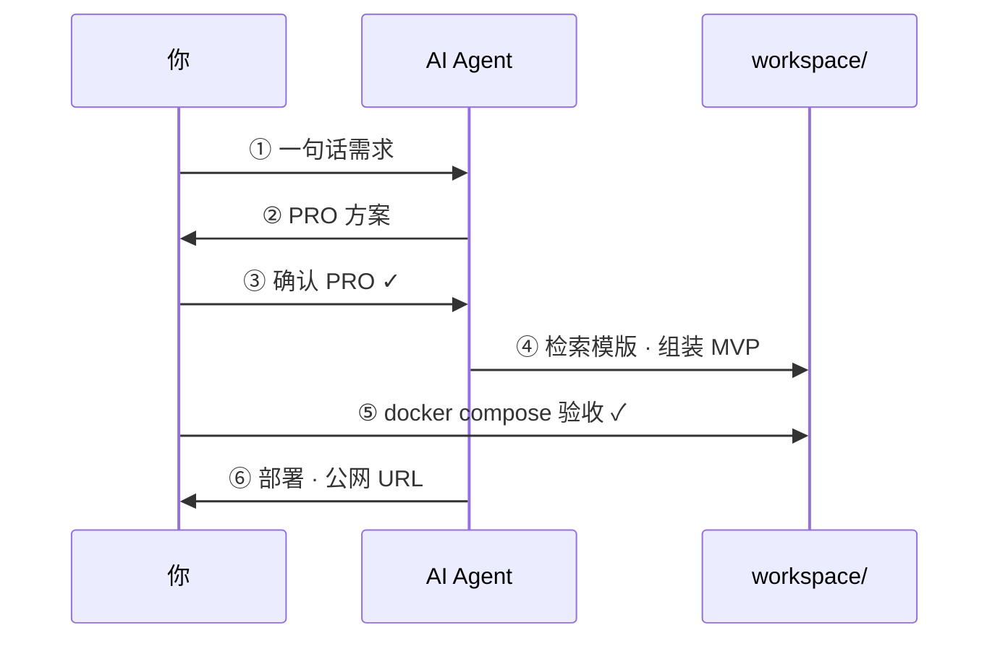

<div align="center">

# 快速开始

### 配合 AI 智能体，六步把 MVP 跑到公网

[← 返回首页](../README.md) · [Agent 契约](../AGENTS.md)

</div>

---

## 准备清单

| 必备 | 可选 |
|------|------|
| 本仓库（clone / fork） | 云服务器 + 域名 |
| Cursor 或其他 Agent IDE | Cloudflare |
| Docker | 本地 GPU + Ollama |

---

## 全流程一览



预计耗时（首次熟悉流程）：

| 阶段 | 时间 |
|------|------|
| 配置 + 出 PRO | ~30 分钟 |
| 组装 + 本地验收 | ~1 小时 |
| 部署上线 | ~10 分钟 |

---

## 逐步操作

### 步骤 0 · 打开仓库

用 **Cursor** 打开 `maker-flow`（推荐）。

首次对话建议：

```
请先阅读 AGENTS.md 和 docs/workflow.md，然后告诉我你已准备好。
```

---

### 步骤 1 · 提供需求

编辑 [`prompts/01-requirement.example.md`](../prompts/01-requirement.example.md)，或直接对 Agent 说：

> 做一个待办事项迷你 API：支持创建、完成、列表，不需要用户系统。

---

### 步骤 2 · AI 出 PRO

对 Agent 说：

```
按 Maker Flow 步骤 ②：
1. 阅读 skills/pro-generation.md
2. 根据我的需求输出 PRO
3. 不要写任何实现代码
```

<details>
<summary>或使用命令行（需配置 ai-engine/.env）</summary>

```bash
cp ai-engine/.env.example ai-engine/.env
# 编辑 AI_BASE_URL、AI_MODEL（参考 ai-engine/providers/）
chmod +x scripts/ai-run.sh
./scripts/ai-run.sh prompts/02-pro-draft.md
```

</details>

PRO 结构见空白骨架 [`prompts/pro.template.md`](../prompts/pro.template.md)，完整样板见 [`prompts/pro.example.md`](../prompts/pro.example.md)（摘要、业务流程、数据模型、接口契约、验收标准）。

---

### 步骤 3 · 确认 PRO

仔细阅读 Agent 输出的 PRO，问自己：

- 范围是不是 **1–2 天能做完**？
- 「不做」清单是否够狠？
- API 和表结构能不能直接实现？

确认后写入 [`prompts/03-pro-confirmed.example.md`](../prompts/03-pro-confirmed.example.md)，勾选 **已确认**（章节对齐 `pro.template.md`）。

> **卡点：** 未确认前，不要让 Agent 写代码。

---

### 步骤 4 · AI 组装 MVP

对 Agent 说：

```
PRO 已确认（见 prompts/03-pro-confirmed.example.md）。
按步骤 ④：
1. skills/template-matching.md + templates/index.md 选模版
2. skills/mvp-assembly.md 组装到 workspace/
```

Agent 应在 `workspace/<项目名>/` 产出可运行工程。

---

### 步骤 5 · 本地验收

```bash
# 若本机尚未构建 Go 基座镜像
./scripts/build-images.sh

cd workspace/<项目名>
cp .env.example .env
docker compose up --build
```

```bash
curl http://localhost:8080/health
# 期望: {"status":"ok"}
```

对照 PRO 里的 **验收标准** 逐项勾选。  
不满意 → 让 Agent 改代码（步骤 4）或改 PRO（步骤 3）。

---

### 步骤 6 · 部署上线

确认 MVP 后，对 Agent 说：

```
MVP 验收通过。按 skills/deploy.md 和 release/ 部署。
```

或手动执行：

```bash
export MVP_NAME=idea1
export MVP_PORT=8080
export DOMAIN=idea1.your-domain.com
export DEPLOY_HOST=deploy@your-server
export DEPLOY_PATH=/opt/mvps/idea1

./release/deploy/push-and-route.sh
```

然后配置 Nginx 片段 + Cloudflare DNS → 访问 `https://idea1.your-domain.com`

---

## 常见问题

<details>
<summary><b>Agent 不按流程走怎么办？</b></summary>

对话里显式 `@AGENTS.md`，并说明：**「当前在第 N 步，不要跳步。」**

</details>

<details>
<summary><b>不想配本地模型？</b></summary>

用 Cursor 内置模型即可，不必配置 `ai-engine/.env`。

</details>

<details>
<summary><b>只有一个 Go 模版够用吗？</b></summary>

MVP 阶段足够。新模版加到 `templates/` 并更新 `templates/index.md` 即可。

</details>

<details>
<summary><b>workspace/ 要提交到 Git 吗？</b></summary>

默认已 gitignore。每个 MVP 建议单独建仓库。

</details>

---

<div align="center">

**跑通一次闭环后，下一个点子只需重复 ①→⑥。**

<br/>

[返回首页](../README.md) · [架构说明](architecture.md)

</div>
