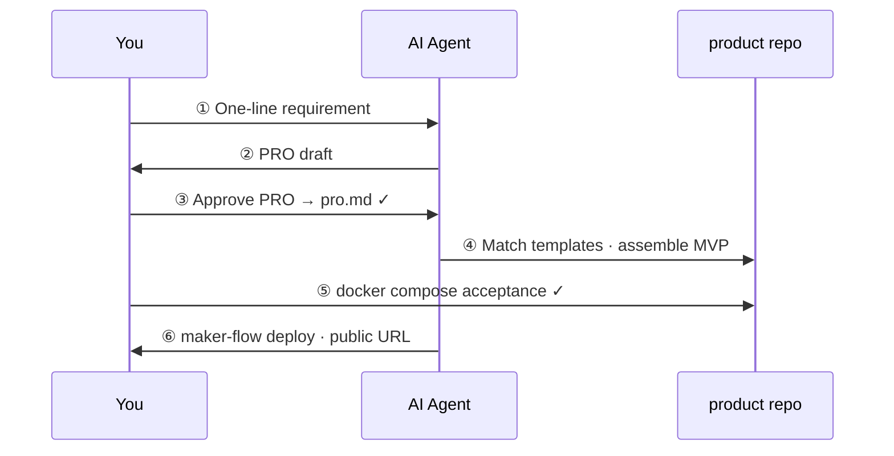

<div align="center">

# Getting started

### Six steps from idea to a public MVP with an AI agent

[← Home](../README.md) · [Consumer guide](consumer-project.md) · [简体中文](getting-started.zh-CN.md)

</div>

---

**English** · [简体中文](getting-started.zh-CN.md)

**Default path:** install factory → `maker-flow new <name>` → open the **product repo** in Cursor. Do not assemble MVPs inside the factory clone.

## Checklist

| Required | Optional |
|----------|----------|
| Docker | Cloud VPS + domain |
| Cursor or another agent IDE | Cloudflare |
| `maker-flow` CLI (`curl … \| bash`) | — |

---

## Flow at a glance



| Phase | Time |
|-------|------|
| Setup + PRO | ~30 min |
| Assemble + local acceptance | ~1 hour |
| Deploy | ~10 min |

---

## Step by step

### Step 0 · Install + create product repo

```bash
curl -fsSL https://raw.githubusercontent.com/LJTian/maker-flow/main/scripts/install.sh | bash
maker-flow new my-todo --requirement "Mini todo API: create, complete, list. No auth."
cd ~/projects/my-todo
```

Open **`~/projects/my-todo`** (the product repo) in Cursor — not the factory clone.

Suggested first message:

```
Read AGENTS.md and $MAKER_FLOW_ROOT/docs/workflow.md.
We are in product repo my-todo. Start at step ①.
```

(`MAKER_FLOW_ROOT` defaults to `~/.maker-flow`; check with `maker-flow root`.)

---

### Step 1 · Provide a requirement

Edit `requirement.md` in the product repo, or tell the agent your idea in chat.

---

### Step 2 · AI drafts PRO

```
Maker Flow step ②:
1. Read $MAKER_FLOW_ROOT/skills/pro-generation.md
2. Output a PRO from my requirement
3. Do not write any implementation code
```

PRO shape: `$MAKER_FLOW_ROOT/prompts/pro.template.md`. Sample: `$MAKER_FLOW_ROOT/prompts/pro.example.md`.

---

### Step 3 · Approve PRO

Review:

- Can it ship in **1–2 days**?
- Is **out of scope** aggressive enough?
- Are APIs and data model implementable as written?

Persist to **`pro.md` in this product repo** and mark confirmed.

> **Gate:** Do not let the agent write code before approval.

---

### Step 4 · AI assembles MVP

```
pro.md is confirmed.
Step ④:
1. $MAKER_FLOW_ROOT/skills/template-matching.md + templates/index.md
2. $MAKER_FLOW_ROOT/skills/mvp-assembly.md — assemble in THIS product repo only
3. Rewrite Go go.mod module paths away from maker-flow/templates/...
```

Expect runnable code under `~/projects/my-todo/` (this repo root).

---

### Step 5 · Local acceptance

```bash
cd ~/projects/my-todo
cp .env.example .env
docker compose up --build
curl http://localhost:8080/health
# expect: {"status":"ok"}
```

Check every **acceptance criterion** in `pro.md`.

---

### Step 6 · Deploy

```bash
maker-flow deploy \
  --domain my-todo.your-domain.com \
  --host deploy@your-server \
  --service api \
  --port 8080
```

`--service` is required (compose service name). Then Cloudflare DNS (Proxied) → public URL.

---

## FAQ

<details>
<summary><b>Agent skips steps?</b></summary>

Explicitly `@AGENTS.md` and say: **“We are on step N — do not skip.”**

</details>

<details>
<summary><b>Factory vs product repo?</b></summary>

Factory (`~/.maker-flow`) is read-only skills/templates. Your MVP lives in `~/projects/<name>/`. See [consumer-project.md](consumer-project.md).

</details>

<details>
<summary><b>Upgrade factory?</b></summary>

```bash
maker-flow upgrade
```

</details>

More: [consumer-project.md](consumer-project.md) · [AGENTS.consumer.example.md](../AGENTS.consumer.example.md) · [workflow.md](workflow.md)
