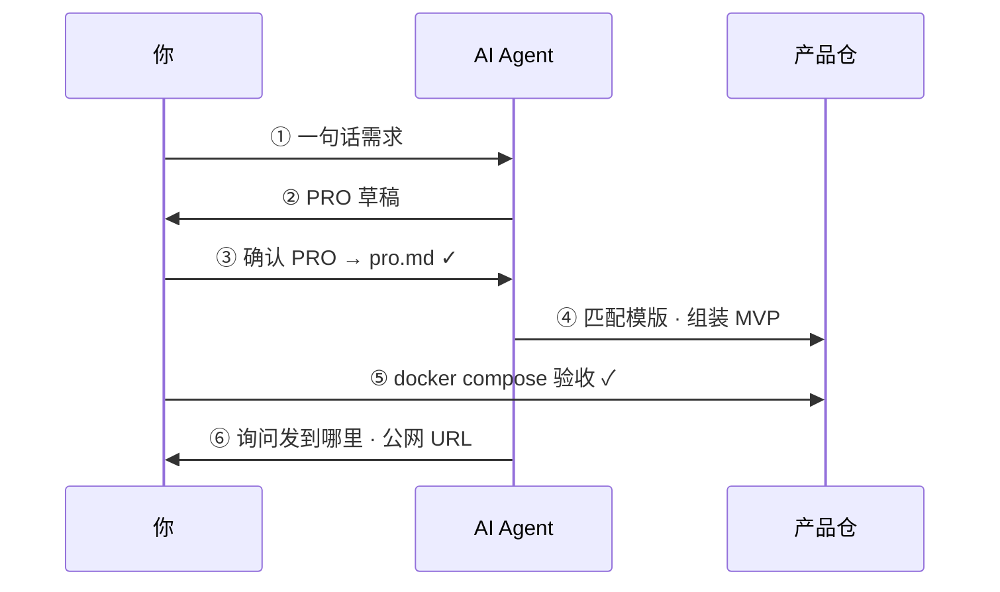

<div align="center">

# 快速开始

### 六步：从一个想法到公网 MVP（配合 AI Agent）

[← 首页](../README.zh-CN.md) · [消费侧指南](consumer-project.zh-CN.md) · [English](getting-started.md)

</div>

---

[English](getting-started.md) · **简体中文**

**默认路径：** 安装工厂 → `maker-flow new <名字>` → 用 Cursor 打开**产品仓**。不要在工厂仓里组装 MVP。

## 清单

| 必需 | 可选 |
|------|------|
| Docker | 云 VPS + 域名 |
| Cursor 或其他 Agent IDE | Cloudflare |
| `maker-flow` CLI（`curl … \| bash`） | — |

---

## 流程一览



| 阶段 | 时间 |
|------|------|
| 安装 + PRO | ~30 分钟 |
| 组装 + 本地验收 | ~1 小时 |
| 部署 | ~10 分钟 |

---

## 逐步操作

### 步骤 0 · 安装并创建产品仓

```bash
curl -fsSL https://raw.githubusercontent.com/LJTian/maker-flow/main/scripts/install.sh | bash
maker-flow new my-todo --requirement "迷你待办 API：创建、完成、列表。不要用户系统。"
cd ~/projects/my-todo
```

用 Cursor 打开 **`~/projects/my-todo`（产品仓）**——不要打开工厂 clone。

建议首条消息：

```
请阅读 AGENTS.md 与 $MAKER_FLOW_ROOT/docs/workflow.md。
当前为产品仓 my-todo。从步骤 ① 开始。
```

（`MAKER_FLOW_ROOT` 默认 `~/.maker-flow`；可用 `maker-flow root` 查看。）

---

### 步骤 1 · 提供需求

编辑产品仓中的 `requirement.md`，或在对话里直接说需求。

---

### 步骤 2 · AI 起草 PRO

```
Maker Flow 步骤 ②：
1. 阅读 $MAKER_FLOW_ROOT/skills/pro-generation.md
2. 根据我的需求输出 PRO
3. 不要写任何实现代码
```

结构见 `$MAKER_FLOW_ROOT/prompts/pro.template.md`，样板见 `pro.example.md`。

---

### 步骤 3 · 确认 PRO

检查：

- 是否 **1–2 天**能做完？
- 「不做」是否够狠？
- API / 数据模型是否可直接实现？

写入本产品仓 **`pro.md`** 并标记已确认。

> **门禁：** 未确认前不要让 Agent 写代码。

---

### 步骤 4 · AI 组装 MVP

```
pro.md 已确认。
步骤 ④：
1. $MAKER_FLOW_ROOT/skills/template-matching.md + templates/index.md
2. $MAKER_FLOW_ROOT/skills/mvp-assembly.md — 只在本产品仓组装
3. 把 Go go.mod 的 module 从 maker-flow/templates/... 改成产品路径
```

可运行代码应在 `~/projects/my-todo/`（本仓根）。

---

### 步骤 5 · 本地验收

```bash
cd ~/projects/my-todo
cp .env.example .env
docker compose up --build
# API 示例：
curl http://localhost:8080/health
# Web（web-vite）示例 — 本机端口常为 3000：
# curl http://localhost:3000/health
# 期望: {"status":"ok"}
```

对照 `pro.md` 验收标准逐项勾选。

本地成功只说明本机映射可用；公网需要步骤 ⑥。

---

### 步骤 6 · 发布（对话）

告诉 Agent MVP 已验收通过。它会问你：

1. 发什么（整站 / 仅前端 / 仅 API）？
2. 发到哪：**Cloudflare Pages / GitHub Pages / Vercel**（静态/SPA）和/或 **自有 VPS**（API、Docker compose）
3. 域名偏好，以及平台登录是否就绪

在对话里回答即可——**你不必运行 deploy 命令**。Agent 按 `$MAKER_FLOW_ROOT/skills/deploy.md` 与 `$MAKER_FLOW_ROOT/release/publish/` 执行，并回报公网 URL。

---

## 常见问题

<details>
<summary><b>Agent 跳步？</b></summary>

显式 `@AGENTS.md`，并说：**「当前在第 N 步，不要跳步。」**

</details>

<details>
<summary><b>工厂 vs 产品仓？</b></summary>

工厂（`~/.maker-flow`）只读 skills/templates。MVP 在 `~/projects/<名字>/`。见 [consumer-project.zh-CN.md](consumer-project.zh-CN.md)。

</details>

<details>
<summary><b>如何升级工厂？</b></summary>

```bash
maker-flow upgrade
```

</details>

更多：[consumer-project.zh-CN.md](consumer-project.zh-CN.md) · [AGENTS.consumer.example.zh-CN.md](../AGENTS.consumer.example.zh-CN.md) · [workflow.zh-CN.md](workflow.zh-CN.md)
