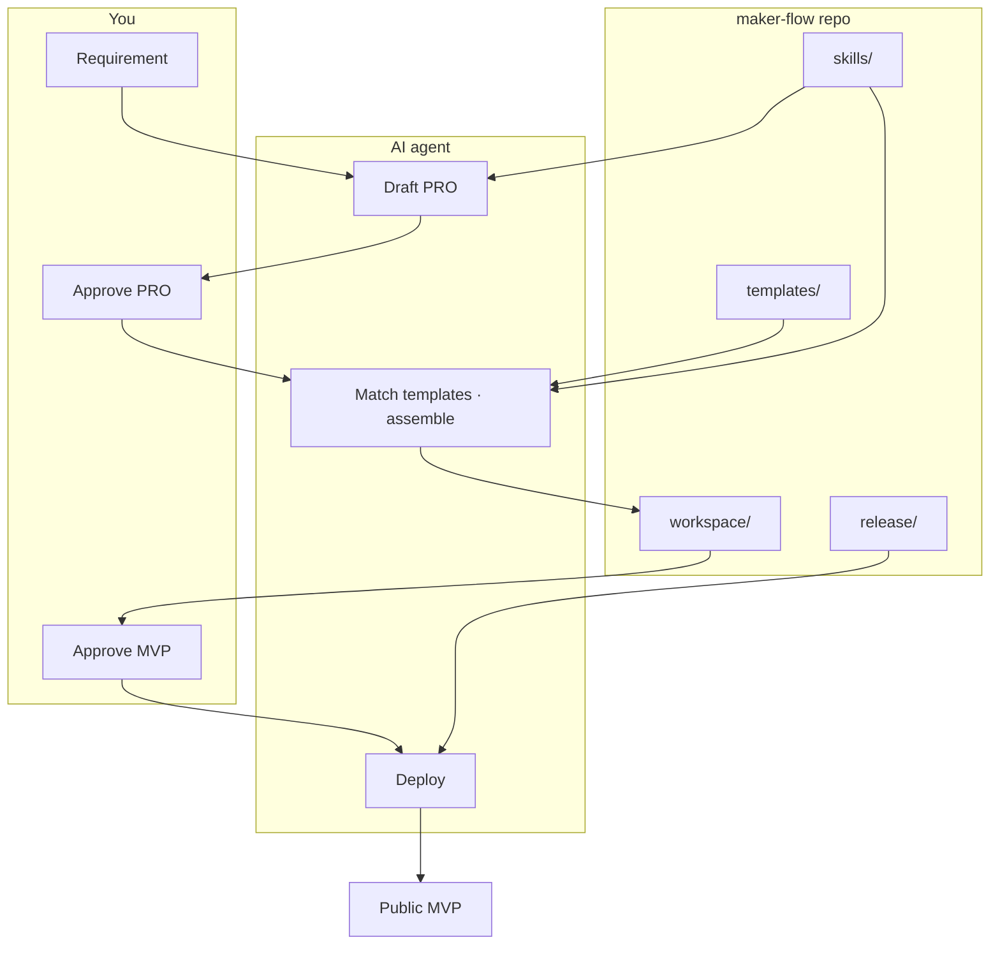

# Architecture overview (humans)

[← Getting started](getting-started.md) · [Agent architecture](architecture.md) · [简体中文](overview.zh-CN.md)

**English** · [简体中文](overview.zh-CN.md)

## Core idea

```
Heavy infrastructure, light logic
     │
     ├── skills/      → how agents work (SOPs)
     ├── templates/   → what to build from (scaffolds)
     └── release/     → how to ship (plumbing)
```

## System relationships



## Directory cheat sheet

| Path | Role | Primary user |
|------|------|--------------|
| `skills/` | Process SOPs | Agent |
| `templates/` | Project scaffolds | Agent match + your acceptance |
| `prompts/` | Stage inputs | You fill requirement; agent reads |
| `workspace/` | MVP output | Agent writes; you run Docker |
| `release/` | Nginx / CF / scripts | Agent or you deploy |
| `ai-engine/` | Optional LLM config | CLI scenarios |
| `AGENTS.md` | Agent contract | Agent |

## Why two gates matter

| Gate | Avoids |
|------|--------|
| ③ Approve PRO | Coding before scope is right |
| ⑤ Approve MVP | Shipping without acceptance |

## Next

- Hands-on: [getting-started.md](getting-started.md)
- Agent details: [../AGENTS.md](../AGENTS.md)
