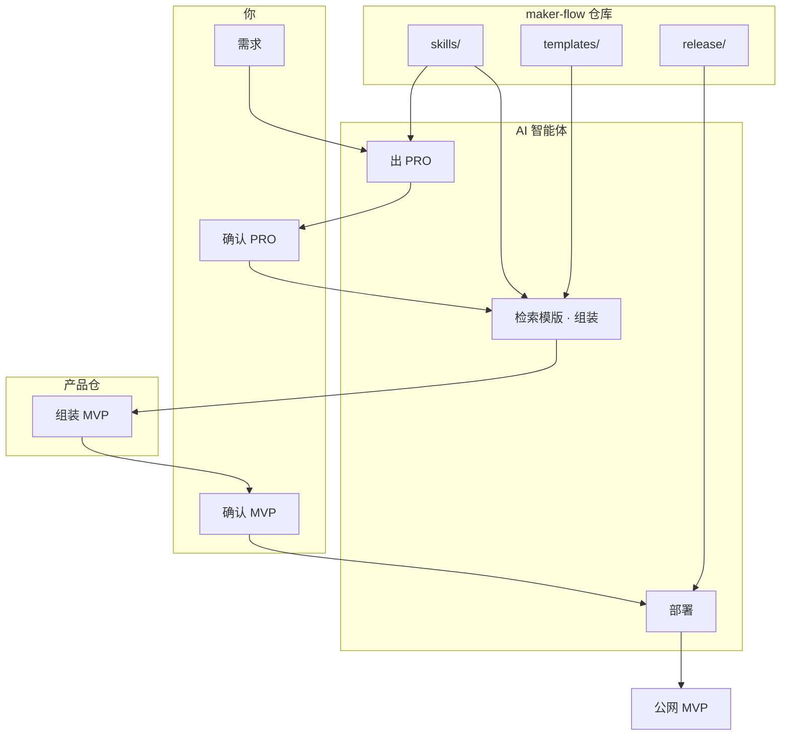

[English](overview.md) · **简体中文**

# 架构一览（给人看）

[← 快速开始](getting-started.md) · [Agent 版架构](architecture.md)

## 核心理念

```
重基建，轻逻辑
     │
     ├── 技能库 skills/     → Agent 怎么做（SOP）
     ├── 模版集 templates/  → 用什么建（预制件）
     └── 发布 release/      → 怎么上线（基建）
```

## 系统关系



## 目录速查

| 目录 | 角色 | 谁主要用 |
|------|------|----------|
| `skills/` | 流程 SOP | Agent |
| `templates/` | 工程模版 | Agent 检索 + 你验收 |
| `prompts/` | 分阶段输入 | 你填需求，Agent 读 |
| `release/` | Nginx / CF / 脚本 | Agent 或你部署 |
| `ai-engine/` | 可选 LLM 配置 | 命令行场景 |
| `AGENTS.md` | Agent 契约 | Agent |

## 两次确认为什么重要

| 卡点 | 避免的问题 |
|------|------------|
| ③ 确认 PRO | AI 一上来就写代码，方向错了白干 |
| ⑤ 确认 MVP | 没验收就部署，公网翻车 |

## 下一步

- 动手：[getting-started.md](getting-started.md)
- Agent 细节：[../AGENTS.md](../AGENTS.md)
